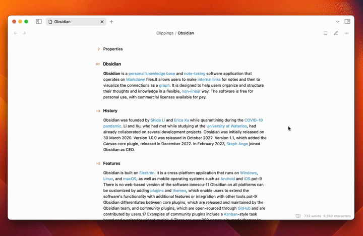
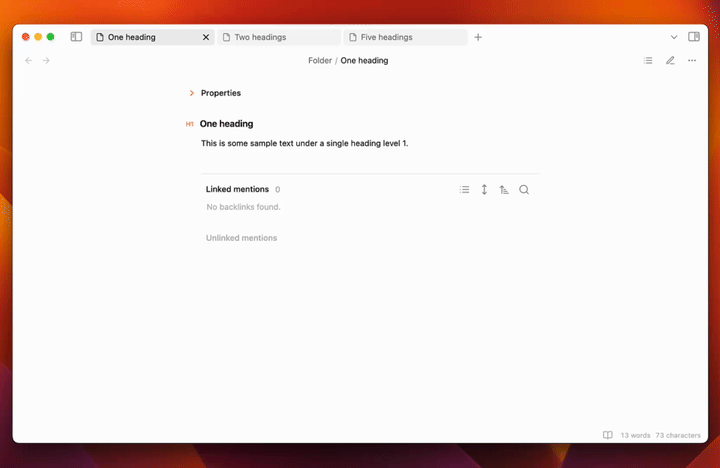
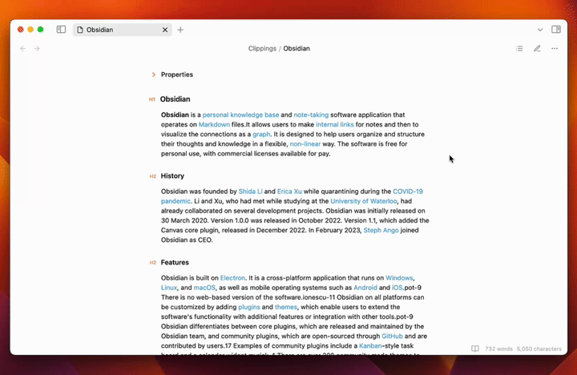

# Dynamic Outline

This plugin for [Obsidian](https://obsidian.md/) creates a simple yet convenient floating table of contents for your notes that saves you space in the sidebar.

## Demo

### Basic Usage

Click the icon in the note toolbar to show the Dynamic Outline. Use the search field for quick navigation.

### Automatic Toggle

Show and hide the Dynamic Outline automatically based on the number of headings in the file.

### Style Settings support

You can customize the style of the Dynamic Outline, e.g. the opacity, by using the [Style Settings](https://obsidian.md/plugins?id=obsidian-style-settings) plugin.

## Contibution

Feel free to open an issue or a pull request if you find a bug or have a feature request.
