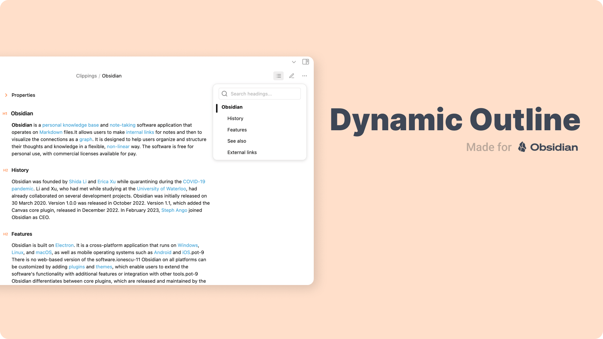
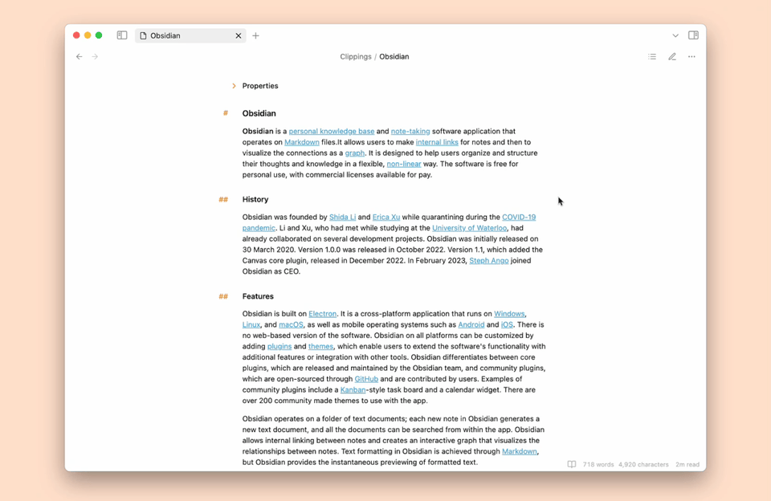
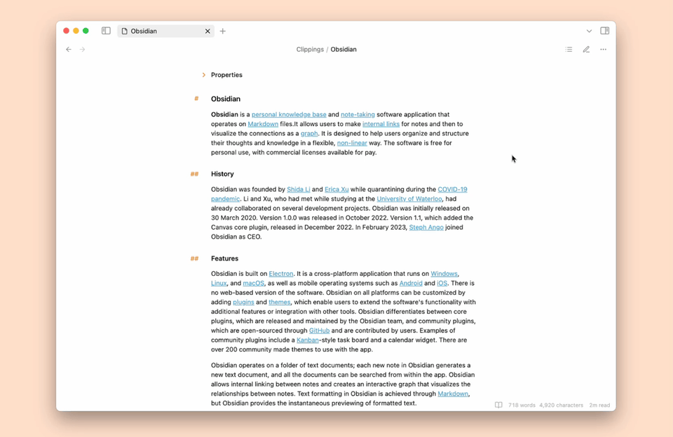
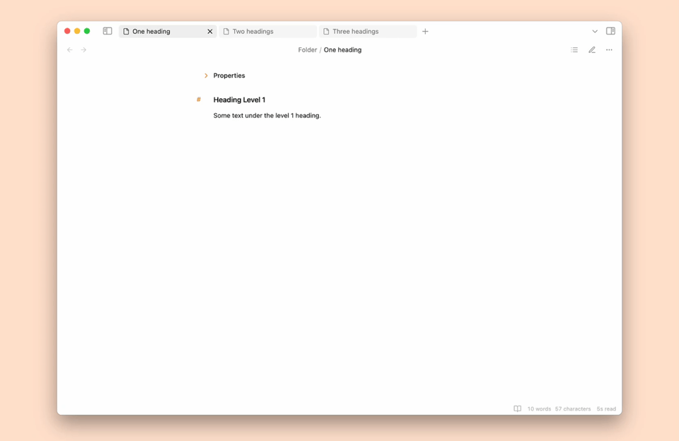

# Dynamic Outline

This [Obsidian](https://obsidian.md/) plugin displays a floating table of contents for your notes, freeing up space in the sidebar.

## Demo

### Basic Usage

Click the icon in the note toolbar to show the Dynamic Outline. Use the search field for quick navigation.

### Search and Navigation

Use the search field to quickly navigate to a heading.

### Automatic Toggle

Show and hide the Dynamic Outline automatically based on the number of headings in the file.

## Contibution

Feel free to open an issue or a pull request if you find a bug or have a feature request.
