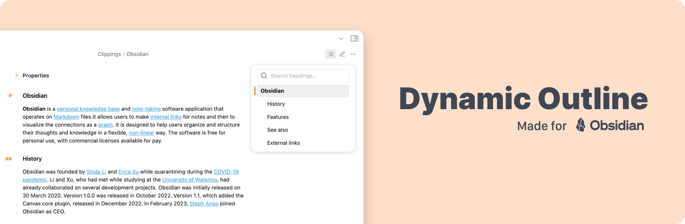
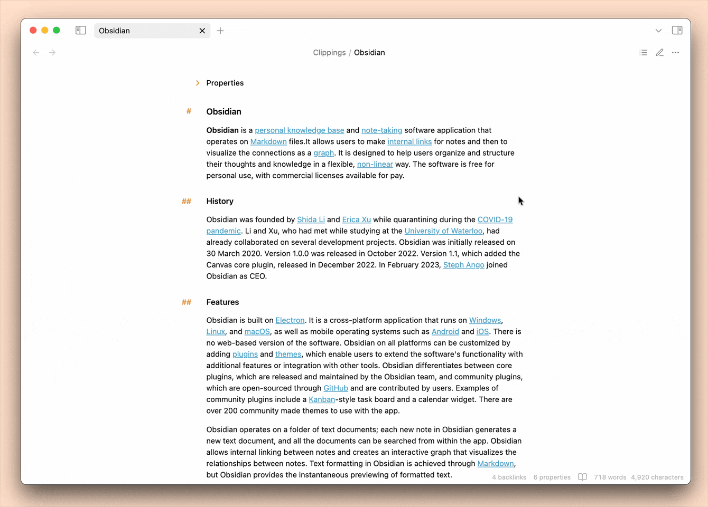

# Dynamic Outline

This [Obsidian](https://obsidian.md/) plugin displays a floating table of contents for your notes for faster navigation, freeing up space in the sidebar.

## Usage

Click the icon on the top right of your current note to instantly open the Dynamic Outline and get a clear view of your note's structure. For an even faster workflow, you can bind the plugin command to a hotkey.

## Features

Here are some of the key features included in the plugin:

-   **Active heading indication.** See current position in the document within the outline. The indicator highlights the heading as you scroll.

-   **Search and navigation.** Quickly find headings using the search bar. Click a search result to jump directly to that section in the note.

-   **Toggle on Hover.** Enable "Toggle on hover" option in settings to have the outline window appear automatically when you hover over the top right toolbar icon.

-   **Keyboard control.** Navigate the outline using keyboard for efficient workflow. Use the arrow keys (or `Tab`/`Shift+Tab`) to move, `Enter` to jump, and `Esc` to close.

-   **Customization via Style Settings.** Personalize the outline's appearance to match your preferences. Customize colors, layout, and more using the [Style Settings](https://github.com/mgmeyers/obsidian-style-settings) plugin.

## How to install

The plugin [is available](https://obsidian.md/plugins?id=dynamic-outline) on the Obsidian Community plugins collection.

## Contibution

Feel free to [report a bug](https://github.com/theopavlove/obsidian-dynamic-outline/issues/new?template=bug_report.md), [request a feature](https://github.com/theopavlove/obsidian-dynamic-outline/issues/new?template=feature_request.md) or [submit a pull request](https://github.com/theopavlove/obsidian-dynamic-outline/pulls).
