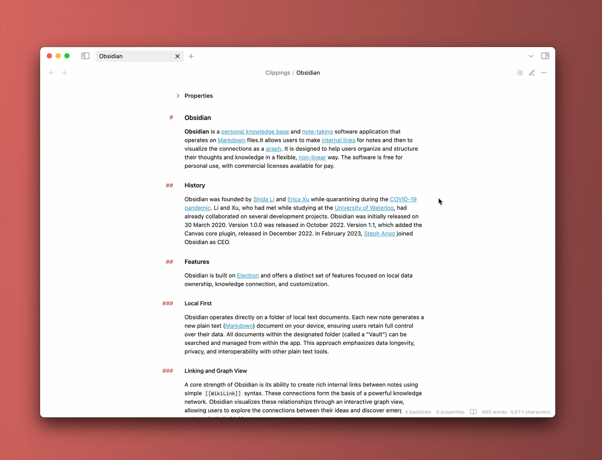

# Dynamic Outline

This [Obsidian](https://obsidian.md/) plugin displays a floating table of contents for quicker navigation within your notes.

## Features

Enjoy a seamless experience from the start, or customize it precisely to your needs with features like:

-   **Active heading indication:** See your current position in the document within the outline.

-   **Search and navigation:** Click a search result to jump directly to that section in the note.

-   **Collapsible headings:** Hide or show sections for better organization.

-   **Keyboard control:** Navigate the outline using the keyboard for an efficient workflow.

-   **Adaptive behavior:** Reveal on file open, toggle on hover, auto-hide, and more.

-   **Rich personalization:** Customize colors, layout, and more using the [Style Settings](https://github.com/mgmeyers/obsidian-style-settings) plugin.

## Usage

Click the icon in the top right of your current note to instantly open the Dynamic Outline and get a clear view of your note's structure. For an even faster workflow, you can bind the plugin command to a hotkey.

## How to install

The plugin [is available](https://obsidian.md/plugins?id=dynamic-outline) in the Obsidian Community plugins collection.

## Contribution

Feel free to [report a bug](https://github.com/theopavlove/obsidian-dynamic-outline/issues/new?template=bug_report.md), [request a feature](https://github.com/theopavlove/obsidian-dynamic-outline/issues/new?template=feature_request.md) or [submit a pull request](https://github.com/theopavlove/obsidian-dynamic-outline/pulls).

If you find this plugin helpful, consider [buying me a coffee](https://www.buymeacoffee.com/theopavlove) to support its continued development.

